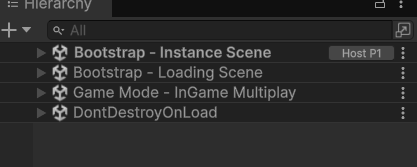
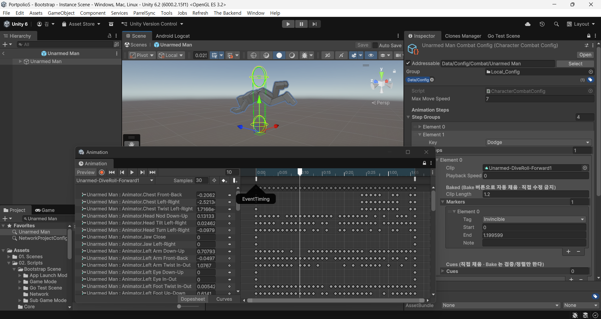

# 🚧 작업 노트 — 나중의 나에게

> [!IMPORTANT]
> **아래 본문은 전부 초안이다.** 포트폴리오 PPT와의 차별점을 아직 고민 중이며, 방향이 정해지면 갈아엎을 수 있다.

### 차별점 정리

| 매체 | 다루는 깊이 |
| --- | --- |
| **포트폴리오 PPT** | 기술의 **트러블 슈팅 · 문제 해결** 과정을 **중급 정도의 디테일**로 서술 |
| **README (이 문서)** | 같은 기술을 **더 디테일하게 파고들기** |

### ❓ 아직 못 정한 것 — 다음에 여기부터

- **어떻게** 더 디테일하게 팔 것인가
- **뭘** 적을 것인가

---

# Portfolio S

> 게임 클라이언트 개발자 공고에서 자주 요구되거나 차별점이 되는 기능을 도입한, 기술 중심 ARPG 포트폴리오
> 싱글+멀티 혼용 가능한 뒤끝 기반 안드로이드 유니티 프로젝트

---

## 목차

<details>
<summary><b><a href="#1-개요">1. 개요</a></b></summary>

- [1.1. 프로젝트 목표](#11-프로젝트-목표)
- [1.2. 기술 스택](#12-기술-스택)

</details>

<details>
<summary><b><a href="#2-프로젝트-구조">2. 프로젝트 구조</a></b></summary>

- [2.1. 부트스트랩 씬 구조](#21-부트스트랩-씬-구조)
- [2.2. 어셈블리 구성](#22-어셈블리-구성)
- [2.3. 씬 구성](#23-씬-구성)

</details>

<details>
<summary><b><a href="#3-앱-부트스트랩">3. 앱 부트스트랩</a></b></summary>

- [3.1. AppLaunchManager 와 실행 모듈](#31-applaunchmanager-와-실행-모듈)
- [3.2. 로딩 씬과 씬 로드 전략](#32-로딩-씬과-씬-로드-전략)
- [3.3. 게임 모드와 서브 매니저](#33-게임-모드와-서브-매니저)

</details>

<details>
<summary><b><a href="#4-네트워크-멀티플레이">4. 네트워크 멀티플레이</a></b></summary>

- [4.1. NetworkRunnerController](#41-networkrunnercontroller)
- [4.2. 매치메이킹과 로비](#42-매치메이킹과-로비)

</details>

<details>
<summary><b><a href="#5-플레이어-컨트롤">5. 플레이어 컨트롤</a></b></summary>

- [5.1. 입력과 가상 조이스틱](#51-입력과-가상-조이스틱)
- [5.2. 플레이어 FSM](#52-플레이어-fsm)
- [5.3. 애니메이션 전략](#53-애니메이션-전략)
- [5.4. 애니메이션 타임라인 마커](#54-애니메이션-타임라인-마커)

</details>

<details>
<summary><b><a href="#6-데이터-파이프라인">6. 데이터 파이프라인</a></b></summary>

- [6.1. 캐릭터 Config](#61-캐릭터-config)
- [6.2. Addressables 프리로드](#62-addressables-프리로드)

</details>

<details>
<summary><b><a href="#7-에디터-툴">7. 에디터 툴</a></b></summary>

- [7.1. Go Test Scene](#71-go-test-scene)
- [7.2. Character Combat Config Editor](#72-character-combat-config-editor)
- [7.3. 뒤끝 차트 동기화](#73-뒤끝-차트-동기화)

</details>

---

## 1. 개요

### 1.1. 프로젝트 목표

— 결정론, 네트워크 동기화, 상태 기반 전투, 데이터 주도 설계, 에셋 로딩 파이프라인 — 을 한 프로젝트 안에서 동작하는 형태로 구현하는 것을 목표로 합니다.

[↑ 목차](#목차)

### 1.2. 기술 스택

| 분류 | 사용 기술 |
| --- | --- |
| 엔진 | Unity |
| 네트워크 | Photon Fusion 2 (Shared / AutoHostOrClient), Fusion KCC Addon, Fusion Physics Addon |
| 백엔드 | 뒤끝(TheBackend) — 구글 로그인, 유저 데이터, CDN 차트 |
| 비동기 | UniTask |
| 에셋 로딩 | Addressables, AWS S3 |
| 입력 | Unity Input System + 커스텀 가상 조이스틱 |
| 디바이스 | AOS |

[↑ 목차](#목차)

---

## 2. 프로젝트 구조

### 2.1. 부트스트랩 씬 구조

앱은 언제나 `Bootstrap - Instance Scene` 하나로 진입하고, 나머지 씬은 그 위에 Additive 로 얹힙니다.



| 씬 | 수&#8288;명 | 하는 일 |
| --- | --- | --- |
| `Bootstrap - Instance Scene` | 상&#8288;시 | 진입점. `BootstrapSceneInstance` 가 `NetworkRunner` · 현재 게임 모드 · 전역 인스턴스 레지스트리를 보유 |
| `Bootstrap - Loading Scene` | 상&#8288;시 | `LoadingSceneManager` 와 로딩 캔버스. 앱 시작 직후 Additive 로드된 뒤 씬 전환시 Canvas Enable 을 통해 씬 전환 연출 |
| `Game Mode - *` | 교&#8288;체 | 실제 콘텐츠 씬. Addressables 또는 Fusion `NetworkSceneManager` 로 로드·언로드 |

씬 전환은 상주 중인 `LoadingSceneManager` 를 거치므로, 게임 모드 씬은 자기 콘텐츠만 담고 전환 로직을 갖지 않습니다. 진입 순서는 [3.1. AppLaunchManager 와 실행 모듈](#31-applaunchmanager-와-실행-모듈), 로드 방식은 [3.2. 로딩 씬과 씬 로드 전략](#32-로딩-씬과-씬-로드-전략) 참고.

[↑ 목차](#목차)

### 2.2. 어셈블리 구성

프로젝트 규모 확장에 따른 의존성 관리와 구조 파악의 어려움을 줄이기 위해 `asmdef`를 적용했습니다. 
기능 단위로 Assembly를 분리하여 의존 방향과 컴파일 범위를 명확하게 통제합니다.

| 어셈블리 | 폴더 | 역할 |
| --- | --- | --- |
| `Core` | `02. Scripts/Core` | 공통 유틸. 참조 목록이 비어 있는 최하위 |
| [`BootstrapScene`](#3-앱-부트스트랩) | `02. Scripts/Bootstrap Scene` | 앱 진입, 실행 모듈, 게임 모드, 네트워크 러너 |
| `Multiplay Definitions` | `02. Scripts/Multiplay Definitions` | 멀티플레이 열거형 · 스테이지 정의. 데이터 계층이 공유하는 어휘만 담음 |
| `PlayerController` | `02. Scripts/Player` | 플레이어 입력 · FSM · 애니메이션 |
| `InGameMultiplay` | `02. Scripts/Other Scenes/InGame Multiplay` | 인게임 씬 조립 (맵/스폰/UI/Config 프리로드) |
| `BackendChart` | `02. Scripts/Scriptable Obejct/Chart Data` | 뒤끝 차트 SO. `Multiplay Definitions` 하나만 참조 |
| `PlayerController.Editor` | `02. Scripts/Player/Editor` | 에디터 전용. `includePlatforms: Editor` 라 빌드에 아예 포함되지 않음 |

[↑ 목차](#목차)

### 2.3. 씬 구성

| 씬 | 설명 |
| --- | --- |
| `Bootstrap - Instance Scene` | 앱 진입점. 전역 인스턴스 보유 |
| `Bootstrap - Loading Scene` | 로딩 연출 및 씬 전환 담당 |
| `Game Mode - Menu Scene` | 메인 메뉴 |
| `Game Mode - Multiplay Lobby Scene` | 멀티플레이 로비 |
| `Game Mode - InGame Multiplay` | 멀티플레이 인게임 |
| `Game Mode - Stage Mode Scene` | 스테이지 모드 |
| `UI Scene - Player Input` | 플레이어 입력 UI (Additive) |
| `For Test/Develop Scene` | 로그인·초기화를 건너뛰는 개발 전용 씬 |

[↑ 목차](#목차)

---

## 3. 앱 부트스트랩

### 3.1. AppLaunchManager 와 실행 모듈

앱 초기화를 **순서를 가진 모듈 배열**로 표현합니다. [`AppLaunchManager`](Assets/02.%20Scripts/Bootstrap%20Scene/AppLaunchManager.cs) 는 인스펙터에 등록된 [`AppLaunchModuleBase`](Assets/02.%20Scripts/Bootstrap%20Scene/App%20Launch%20Module/00.%20Root%20Scripts/AppLaunchModuleBase.cs) 를 순차적으로 `await` 하기만 합니다.

<pre>
<a href="Assets/02.%20Scripts/Bootstrap%20Scene/AppLaunchManager.cs">AppLaunchManager</a>
├── firstLaunchModule    → ExecuteSync()  : <a href="Assets/02.%20Scripts/Bootstrap%20Scene/App%20Launch%20Module/01.%20Depth%201/LoadingSceneLoadManager.cs">LoadingSceneLoadManager</a> — 로딩 씬 먼저 띄움
└── appLaunchModules[]   → ExecuteAsync() : 순차 실행
    ├── <a href="Assets/02.%20Scripts/Bootstrap%20Scene/App%20Launch%20Module/01.%20Depth%201/TheBackendInitManager.cs">TheBackendInitManager</a>
    ├── <a href="Assets/02.%20Scripts/Bootstrap%20Scene/App%20Launch%20Module/01.%20Depth%201/TheBackendLoginManager.cs">TheBackendLoginManager</a>
    ├── <a href="Assets/02.%20Scripts/Bootstrap%20Scene/App%20Launch%20Module/01.%20Depth%201/TheBackendUserDataLoader.cs">TheBackendUserDataLoader</a>
    └── ...
</pre>

초기화 단계가 늘어나도 매니저 코드를 건드리지 않고 모듈만 추가합니다.

[↑ 목차](#목차)

### 3.2. 로딩 씬과 씬 로드 전략

씬 로드는 로컬 로드와 네트워크 로드가 필요하지만 호출부는 같아야 하므로, `SceneLoadStrategyBase` 를 두고 구현을 갈랐습니다.

| 전략 | 용도 |
| --- | --- |
| `LocalSceneLoader` | `SceneManager` 기반 단독 씬 로드 |
| `NetworkSceneLoader` | Fusion `NetworkSceneManager` 를 통한 동기화 로드 |

`LoadingSceneManager` 는 `OnSceneActivated` / `OnCompleteLoad` 이벤트를 발행해, 게임 모드가 "에셋 활성화 시점"과 "모든 준비 완료 시점"을 구분해 훅을 걸 수 있게 합니다.

[↑ 목차](#목차)

### 3.3. 게임 모드와 서브 매니저

씬마다 `GameModeBase` 파생 클래스가 하나 존재하고, 그 아래 `SubManagerBase` 배열이 초기화 순서를 표현합니다.

```
GameModeBase (EGameModeType)
├── OnSceneActivated()          로딩 중 — SubManager 들의 DoInit() 을 순서대로 await
└── OnSceneCompletelyLoaded()   로딩 완료 후 진입 처리
```

`MultiplayerInGameMode` 에서는 이 순서가 곧 의존 순서입니다. 예를 들어 `CharacterConfigPreloader` 는 반드시 `PlayerCharacterSpawner` 보다 앞에 있어야 합니다.

[↑ 목차](#목차)

---

## 4. 네트워크 멀티플레이

### 4.1. NetworkRunnerController

[`NetworkRunnerController`](Assets/02.%20Scripts/Bootstrap%20Scene/Network/NetworkRunnerController.cs) 는 `INetworkRunnerCallbacks` 를 구현하는 프로젝트 내 유일한 클래스입니다. 구현체를 하나로 모으기 위해 Fusion 콜백을 C# 이벤트로 다시 발행합니다.

| 이벤트 | 원본 콜백 | 구독자 |
| --- | --- | --- |
| `SceneLoadStart` | `OnSceneLoadStart` | [`NetworkSceneLoader`](Assets/02.%20Scripts/Bootstrap%20Scene/App%20Launch%20Module/Loading%20Scene/Loading%20Scene%20Strategy/NetworkSceneLoader.cs) |
| `SceneLoadDone` | `OnSceneLoadDone` | [`NetworkSceneLoader`](Assets/02.%20Scripts/Bootstrap%20Scene/App%20Launch%20Module/Loading%20Scene/Loading%20Scene%20Strategy/NetworkSceneLoader.cs) |
| `InputPolling` | `OnInput` | [`VirtualJoystickPresenter`](Assets/02.%20Scripts/Player/VirtualJoystickPresenter.cs) |
| `PlayerJoined` | `OnPlayerJoined` | [`DevelopSceneManager`](Assets/02.%20Scripts/Develop%20Scene/DevelopSceneManager.cs) |

[↑ 목차](#목차)

### 4.2. 매치메이킹과 로비

[`MatchMakingManager`](Assets/02.%20Scripts/Other%20Scenes/Menu%20Scene/Multiplay%20Type/MatchMakingManager.cs) 가 `GameMode.AutoHostOrClient` 로 세션 참가/생성을 일원화합니다. 첫 참가자가 호스트가 되고 이후 참가자는 클라이언트로 붙습니다.

로비는 MVP 로 분리되어 있습니다. 상태의 원본이 하나 있고 표현은 그 데이터를 읽어 그리기만 한다는 점에 주목해서 MVP 를 Lobby UI 구현에 적용했습니다.

| 역할 | 클래스 | 하는 일 |
| --- | --- | --- |
| **Model** | [`LobbyStateManager`](Assets/02.%20Scripts/Other%20Scenes/Menu%20Scene/Multiplay%20Type/LobbyStateManager.cs) | `NetworkBehaviour`. `[Networked] NetworkArray<LobbyPlayerRef>` 가 로비 상태의 유일한 원본이고, 값이 바뀌면 `OnChangedLobbyPlayer` 를 발행 |
| | [`LobbyPlayerRef`](Assets/02.%20Scripts/Other%20Scenes/Menu%20Scene/Multiplay%20Type/LobbyStateManager.cs) | 플레이어 한 명의 데이터 — 닉네임 · 준비 여부 · 호스트 여부. `INetworkStruct` |
| **View** | [`MultiplayStageElementView`](Assets/02.%20Scripts/Other%20Scenes/Menu%20Scene/Multiplay%20Type/View/MultiplayStageElementView.cs) | 스테이지 선택 버튼 |
| | [`CreateSessionView`](Assets/02.%20Scripts/Other%20Scenes/Menu%20Scene/Multiplay%20Type/View/CreateSessionView.cs) | 맵 선택 → 매칭 → 준비 → 시작으로 이어지는 버튼 상태 표시 |
| | [`LobbyPlayerManagerView`](Assets/02.%20Scripts/Other%20Scenes/Menu%20Scene/Multiplay%20Type/View/LobbyPlayerManagerView.cs) | `Render(NetworkArray<LobbyPlayerRef>)` 로 슬롯 전체를 갱신 |
| | [`LobbyCharacterSlotView`](Assets/02.%20Scripts/Other%20Scenes/Menu%20Scene/Multiplay%20Type/View/LobbyCharacterSlotView.cs) | 슬롯 한 칸 — 플레이어 표시 |
| | [`LobbyCharacterReadyView`](Assets/02.%20Scripts/Other%20Scenes/Menu%20Scene/Multiplay%20Type/View/LobbyCharacterReadyView.cs) | 슬롯 한 칸 — 준비 상태 표시 |
| **Presenter** | [`MultiplayerScenePresenter`](Assets/02.%20Scripts/Other%20Scenes/Menu%20Scene/Multiplay%20Type/MultiplayerScenePresenter.cs) | 양쪽을 모두 아는 유일한 지점. View 의 버튼 이벤트를 받아 Model 을 RPC 로 갱신하고, Model 의 변경 이벤트를 받아 View 를 렌더 |

View 는 Model 을, Model 은 View 를 서로 모릅니다. `LobbyStateManager` 는 상태가 바뀌었다는 사실만 이벤트로 알리고, 그 이벤트를 어떤 View 가 어떻게 그릴지는 `MultiplayerScenePresenter` 만 압니다.

[↑ 목차](#목차)

---

## 5. 플레이어 컨트롤

State 와 Strategy 는 계산, 렌더의 역할만 한다는 것에 주목해 순수 C# 클래스(POCO)로 생성. 

엔진·네트워크를 실제로 건드리는 지점인 [`PlayerFSMController`](Assets/02.%20Scripts/Player/Player%20FSM/PlayerFSMController.cs)와[`PlayerNetworkedAnimatorController`](Assets/02.%20Scripts/Player/PlayerNetworkedAnimatorController.cs)만 `NetworkBehaviour` 로 남겨둠.

- **State** ([`PlayerStateBase`](Assets/02.%20Scripts/Player/Player%20FSM/States/Base%20Script/PlayerStateBase.cs)) —

  스탯 · Config · 경과 시간을 읽어 판정하는 데이터 계층. 시간 기준인 [`ActionComponent.Elapsed`](Assets/02.%20Scripts/Player/Player%20FSM/Sub%20Component/ActionComponent.cs) 가 `Time` 이 아니라 틱(`Runner.Tick - ActionStartTick`)에서 나오므로, 판정이 프레임과 무관하고 Fusion 재시뮬레이션에서도 같은 결과가 나옵니다.

- **Strategy** ([`PlayerAnimationStrategyBase`](Assets/02.%20Scripts/Player/Player%20FSM/Animation%20Strategies/Base%20Script/PlayerAnimationStrategyBase.cs)) —

  `Render()` 에서 `Animator` 만 다루는 표현 계층.

- **`NetworkBehaviour`** —

  [`PlayerFSMController`](Assets/02.%20Scripts/Player/Player%20FSM/PlayerFSMController.cs)(시뮬레이션 · 상태 동기화), [`PlayerNetworkedAnimatorController`](Assets/02.%20Scripts/Player/PlayerNetworkedAnimatorController.cs)(`Render()` 진입점), [`ActionComponent`](Assets/02.%20Scripts/Player/Player%20FSM/Sub%20Component/ActionComponent.cs)(틱 · 스탯 보유).

### 5.1. 입력과 가상 조이스틱

Fusion 의 `INetworkInput` 구조체로 이동 방향과 버튼을 함께 전송합니다.

```csharp
public struct PlayerInput : INetworkInput
{
    public Vector3 direction;
    public NetworkButtons buttons;
}

public enum EPlayerButton
{
    NormalAttack, Dodge, Expert, Ultimate, Interact, Count
}
```

가상 조이스틱은 Presenter / View 로 분리되어 있습니다 (`VirtualJoystickPresenter`, `VirtualJoystickBackgroundView`, `VirtualJoystickHandleView`).

[↑ 목차](#목차)

### 5.2. 플레이어 FSM

`PlayerFSMController` 는 `NetworkBehaviour` 로, 현재 상태를 `[Networked]` 프로퍼티로 동기화합니다. 상태 전이는 `FixedUpdateNetwork` 안에서만 일어나므로 Fusion 의 재시뮬레이션에 안전합니다.

| 상태 | 클래스 |
| --- | --- |
| Idle | `IdleState` |
| Move | `MoveState` |
| NormalAttack | `NormalAttackState` |
| Dodge | `DodgeState` |
| Expert | `ExpertState` |

```
FixedUpdateNetwork
├── TryGetInputForPlayer
├── buttons.GetPressed(PreviousButtons)   이번 틱의 신규 입력 산출
├── ResolveDesiredState(input, pressed)   원하는 상태 결정
├── ConvertState(desired)                 전이 가능하면 상태 교체
└── stateDict[CurrentState].OnUpdateState
```

[↑ 목차](#목차)

### 5.3. 애니메이션 전략

상태별 애니메이션 재생 로직은 FSM 상태와 분리해 `PlayerAnimationStrategyBase` 파생 클래스로 두었습니다. 재생 자체는 `PlayerNetworkedAnimatorController` 가 네트워크 동기화된 형태로 담당합니다.

`Animator` 의 Parameter 를 세팅하는 지점도 FSM 이 아니라 이 전략들입니다. 파라미터 값은 `[Networked] PlayerNetworkedAnimatorData` 로 복제됩니다.

| 전략 | 대응 |
| --- | --- |
| `LocomotionStrategy` | Idle / Move |
| `NormalAttackStrategy` | 일반 공격 콤보 |
| `DodgeStrategy` | 회피 |
| `ExpertStrategy` | 전문 스킬 |

[↑ 목차](#목차)

### 5.4. 애니메이션 타임라인 마커

처음엔 로컬 프로젝트처럼 Animation Clip 에 AnimationEvent 를 직접 부착. 그러나 Unity Frame 과 Fusion Simulation Tick 의 불일치로 이벤트가 발행되지 않는 시점이 발생.

- Tick 기준으로 판정하려면 이벤트가 놓인 **정확한 시각**이 필요.
- 비개발자와의 협업을 위해 "클립에 이벤트를 찍는다" 는 작업 방식은 유지해야 함.
- 클립이 바뀌면 수치가 자동으로 따라올 것.

그래서 클립의 이벤트를 읽어 [`AnimationTimeline`](Assets/02.%20Scripts/Player/AnimationTimeline.cs) 으로 굽는 [에디터(line:186)](Assets/02.%20Scripts/Player/Editor/CharacterCombatConfigEditor.cs#L186)를 구현. 런타임은 클립 이벤트가 아니라 구워진 **마커의 데이터**와 `Elapsed` 를 비교.

| 마커 | 종류 | 의미 |
| --- | --- | --- |
| `ComboInput` | Range | 다음 콤보 입력을 받는 구간 |
| `ComboDecision` | Point | 콤보 이행 여부를 확정하는 시점 |
| `Invincible` | Range | 무적 구간 |
| `Hitbox` | Range | 히트박스 활성 구간 |
| `Trigger` | Point | 임의 트리거 |

<details>
<summary><b>(시각 자료 1) 에디터 화면</b></summary>



왼쪽 Animation 창의 `EventTiming` 이벤트가 오써링 소스이고, 오른쪽 Inspector 의 `Markers`(`Invincible` · `Start 0` · `End 1.199599`)가 구워진 결과입니다.

</details>

`AnimMarkerInfo.KindOf` 가 태그별 종류를 한 곳에서 정의하며, 베이크 시 검증 규칙도 여기에 맞춰 동작합니다. 마커 수신은 [`AnimationMarkerReceiver`](Assets/02.%20Scripts/Player/AnimationMarkerReceiver.cs) 가 담당합니다.

[↑ 목차](#목차)

---

## 6. 데이터 파이프라인

### 6.1. 캐릭터 Config

캐릭터의 수치와 애니메이션 데이터는 두 개의 SO 로 나뉩니다.

| SO | 내용 |
| --- | --- |
| `CharacterCombatConfig` | 이동 속도, 상태별 애니메이션 스텝(`EAnimStepKey` → `AnimationTimeline[]`), 회피 속도 커브 |
| `CharacterStatConfig` | 캐릭터 스탯 |

[↑ 목차](#목차)

### 6.2. Addressables 프리로드

`CharacterConfigPreloader` 는 세션 참가자들이 고른 캐릭터만 골라 Config 를 미리 로드합니다.

```
DoInit()
├── PlayableCharacterInfoSO 로드
├── SessionContext.UserData 에서 각 플레이어의 mainCharacterIndex 조회
├── 캐릭터별로 Data/Config/Combat/{name}, Data/Config/Stat/{name} 로드
└── CharacterConfigRegistry.Register
```

중복 선택은 걸러내고, 핸들은 리스트로 모아 `OnDestroy` 에서 일괄 해제합니다.

[↑ 목차](#목차)

---

## 7. 에디터 툴

SO 의 성격에 따라 붙는 툴이 다릅니다.

- **숫자·문자열만 담긴 SO** — 언리얼의 **DataTable(DT)** 에 해당. 원본이 서버 차트라 사람이 손댈 필요 없이 통째로 다시 받으면 됨 → [7.3. 뒤끝 차트 동기화](#73-뒤끝-차트-동기화)
- **Unity Asset 참조를 담은 SO** — 언리얼의 **DataAsset(DA)** 에 해당. 클립·커브를 사람이 붙여야 하므로 편집 UI 가 필요 → [7.2. Character Combat Config Editor](#72-character-combat-config-editor)

### 7.1. Go Test Scene

로그인과 앱 초기화를 건너뛰고 곧장 개발 씬으로 진입하는 에디터 전용 스위치입니다. `GoTestSceneSettings.Enabled` 가 켜져 있으면 `AppLaunchManager` 가 초기화 파이프라인 대신 `Develop Scene` 을 로드합니다. 씬 뷰 오버레이(`GoTestSceneSceneViewOverlay`)와 전용 윈도우(`GoTestSceneWindow`)로 토글합니다.

[↑ 목차](#목차)

### 7.2. Character Combat Config Editor

`CharacterCombatConfigEditor` 는 애니메이션 스텝 그룹 편집과 클립 이벤트 → 마커 베이크를 담당합니다. 베이크 시 `AnimMarkerInfo.KindOf` 규칙에 따라 Range 마커의 시작/끝 쌍을 검증합니다.

[↑ 목차](#목차)

### 7.3. 뒤끝 차트 동기화

DT 성격의 SO 는 손으로 옮겨 적을 이유가 없으므로, [`BackendChartManager`](Assets/Editor/Chart%20Update/BackendChartManager.cs) 가 **F5** 한 번에 프로젝트의 모든 [`ChartDataSOBase`](Assets/02.%20Scripts/Scriptable%20Obejct/Chart%20Data/00.%20Root%20Script/ChartDataSOBase.cs) 를 찾아 뒤끝 CDN 차트로 덮어씁니다.

```
F5  (MenuItem "Refresh/Refresh Chart Definition _F5")
├── AssetDatabase.FindAssets("t:ChartDataSOBase")
├── SO 마다 LoadChart()  — chartId 로 CDN 차트를 찾아 DeserializeFlattenRows
└── SaveAssets
```

| SO | 내용 |
| --- | --- |
| `MultiplayStageDataSO` | 멀티플레이 스테이지 정보 |
| `PlayableCharacterInfoSO` | 플레이 가능 캐릭터 목록 |

파생 클래스는 `DeserializeFlattenRows` 만 구현하면 이 파이프라인에 자동으로 편입됩니다. `LoadChart` 는 `#if UNITY_EDITOR` 안에 있어 빌드에는 포함되지 않고, 런타임은 구워진 SO 만 읽습니다.

[↑ 목차](#목차)
